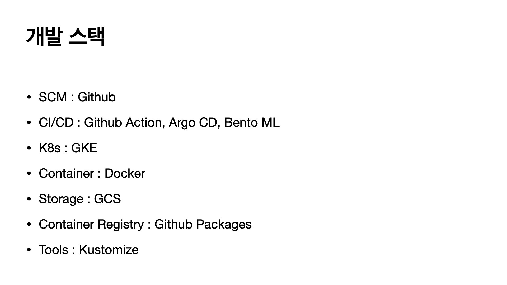
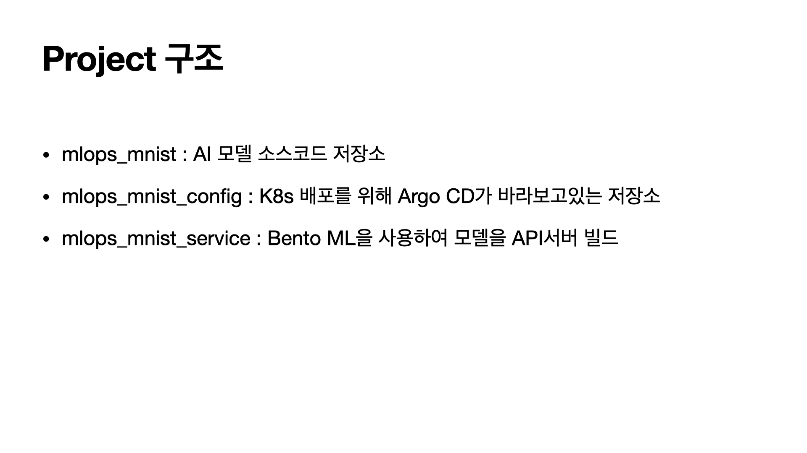
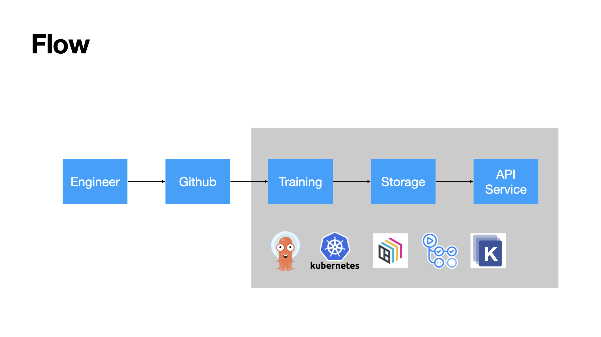
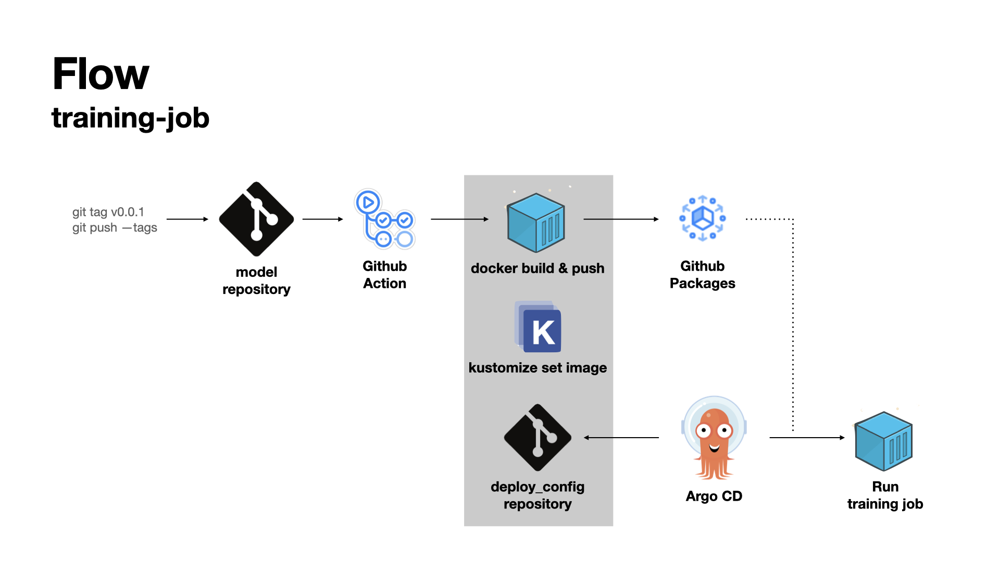
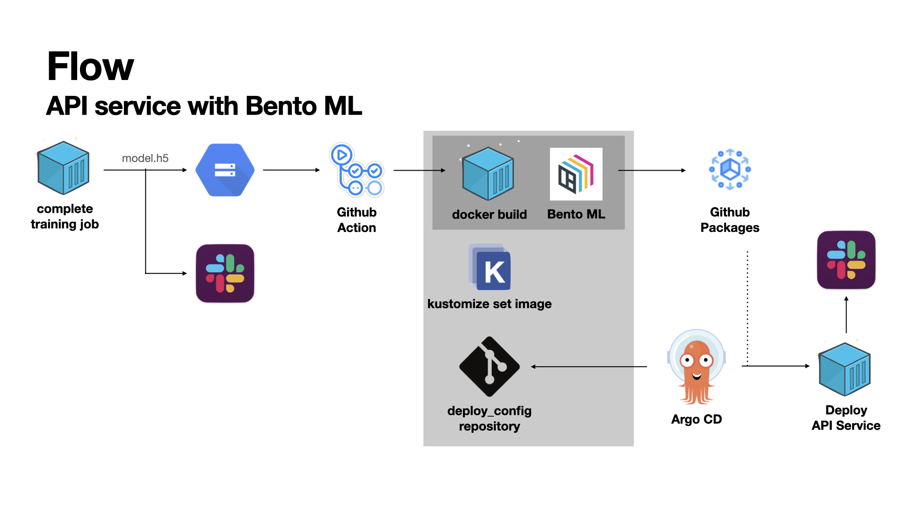
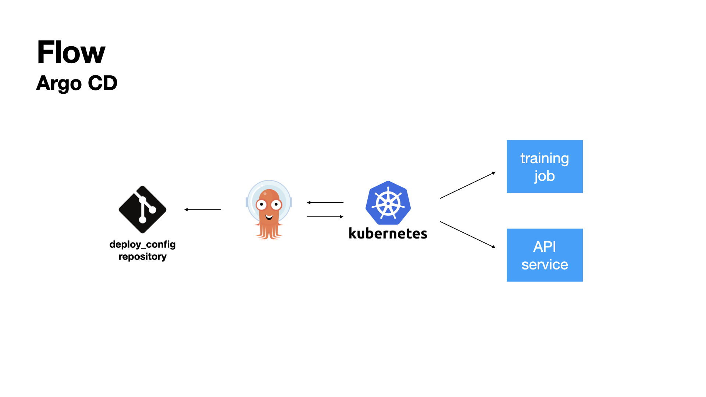

# MNIST로 Mlops 구축하기

Aiffel 과정중 두번째 미니해커톤에서 5일간 진행한 프로젝트입니다.

#### 잘한 점
* 짧은 기간에 MLOps에 대한 지식이 거의 없는 상태에서 어느정도 자동화를 이루어냈다.

#### 아쉬운 점
* 각각의 repository 이름을 대충 짓고 시작했더니 약간의 혼란이 있었다.
* 데이터나 코드를 다루는 다른 ML 프로젝트와는 다르게 인프라를 다루는 프로젝트는 처음이라 팀원들과 협업할 방법을 찾기 어려웠다.
* Best practice나 보편적으로 사용되는 패턴을 찾기 어려워서  프로젝트를 잘 진행하고있는지, 좋은 구조를 만들고있는지 알 수 없었다.